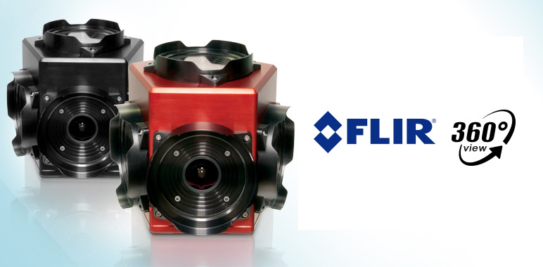

# ladybug_camera_driver

## Overview

This repository contains a ROS package for interfacing with the Flir Ladybug 5P 360 degree camera. 

### License

The source code is released under a [BSD 3-Clause license](ladybug_camera_driver/LICENSE).

**Author: Steve Phillips 
Affiliation: [SDIC Lab](http://www.civil.uwaterloo.ca/snarasim/) 
Maintainer: Steve Phillips, sjphilli@uwaterloo.ca**

The ladybug_camera_driver package has been tested under [ROS] Kinetic and Ubuntu 16.04. 

## Usage

This package uses nodelets to interface with and publish images from the camera. The camera nodelet can be launched with:

* **camera.launch:**

     - **`argument_1`** Short description (e.g. as commented in launch file). Default: `default_value`.
     - **`data_capture_format`** (string, default: `raw8`)
     - **`color_processing_method`** (string, default: `downsample16`)
     - **`processed_pixel_format`** (string, default: `bgr8`)
     - **`frame_id`** (string, default: `camera`)
     - **`diagnostics_desired_freq`** (int, default: `10`)
     - **`diagnostics_min_freq`** (int, default: `10`)
     - **`diagnostics_max_freq`** (int, default: `10`)
     - **`diagnostics_freq_tolerance`** (int, default: `0.1`)
     - **`diagnostics_window_size`** (int, default: `10`)
     - **`diagnostics_min_acceptable_delay`** (int, default: `0.0`)
     - **`diagnostics_max_acceptable_delay`** (int, default: `0.01`)

## Nodelets

### LadybugNodelet

#### Published Topics

* **`/ladybug/camera_[1-6]/camera_info`** ([sensor_msgs/CameraInfo])

	Camera info topic for each of the 6 cameras.

* **`/ladybug/camera_[1-6]/image_raw`** ([sensor_msgs/Image])

	The raw bayer images from each camera are each published on their own topic via. image_transport.
	
* **`/ladybug/camera_[1-6]/image_raw`** ([ladybug_msgs/LadybugTiles])

	The LadybugTiles.msg contains an array of 6 sensor_msgs/Image messages, corresponding to each of the 6 tiles. 
	
* **`/diagnostics`** ([diagnostic_msgs/DiagnosticArray])

	Publishes diagnostics information from the ladybug (temperature, pressure).

## Bugs & Feature Requests

Please report bugs and request features using the [Issue Tracker](https://github.com/sjphilli/ladybug/ladybug_camera_driver/issues).
